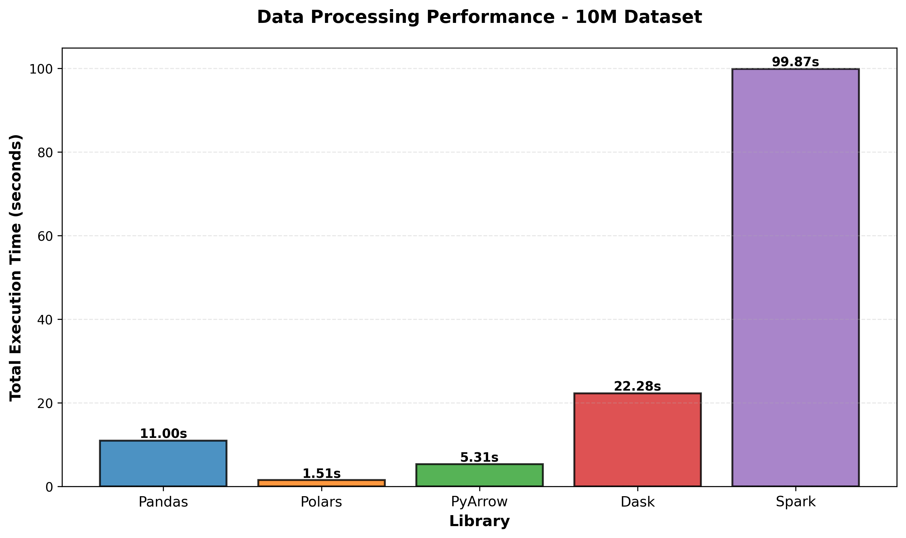

# 📊 Comparative Visualization Analysis

## Plik do Pracy Magisterskiej - Rozdział o Porównaniu Bibliotek Wizualizacyjnych

---

## 🎯 Cel

Plik `comparative_visualization_thesis.py` zawiera **side-by-side implementacje** 7 wspólnych wykresów dla 5 bibliotek wizualizacyjnych w Pythonie.

**Dla kogo:**
- Studenci piszący prace magisterskie z data science
- Badacze porównujący narzędzia wizualizacji
- Developerzy wybierający bibliotekę do projektu

---

## 📦 Zawartość

### Zaimplementowane Wykresy (7 × 5 = 35 wizualizacji)

#### Data Processing (4 wykresy):
1. **Execution Time Comparison** - Całkowity czas wykonania
2. **Operation Breakdown** - Rozbicie na operacje (grouped bars)
3. **Memory Usage** - Zużycie pamięci
4. **Scalability Analysis** - Wydajność vs rozmiar danych (line chart)

#### ML/DL Frameworks (3 wykresy):
5. **Training Time Comparison** - Czas trenowania
6. **Inference Speed Comparison** - Prędkość inferencji
7. **Memory Usage (ML)** - Pamięć podczas treningu

### Biblioteki

| # | Biblioteka | Output | Interaktywność | Najlepsze dla |
|---|------------|--------|----------------|---------------|
| 1 | **Bokeh** | HTML | ⭐⭐⭐⭐⭐ | Kontrola szczegółów |
| 2 | **Holoviews** | HTML | ⭐⭐⭐⭐⭐ | Czysty kod |
| 3 | **Matplotlib** | PNG | ❌ | Publikacje |
| 4 | **Plotly** | HTML | ⭐⭐⭐⭐ | Szybki development |
| 5 | **Streamlit** | Web App | ⭐⭐⭐⭐⭐ | Dashboardy |

---

## 🚀 Instalacja

### 1. Zainstaluj wymagane biblioteki

```bash
pip install pandas numpy matplotlib plotly bokeh holoviews streamlit
```

### 2. Sprawdź strukturę katalogów

```
data_visualization/
├── comparative_visualization_thesis.py  ← GŁÓWNY PLIK
├── COMPARATIVE_ANALYSIS_README.md       ← Ten plik
├── results/                             ← Wyniki data processing
│   ├── performance_metrics_pandas_10M.json
│   ├── performance_metrics_polars_10M.json
│   └── ...
└── models/results/                      ← Wyniki ML/DL
    ├── sklearn_anomaly_detection_results.json
    ├── pytorch_anomaly_detection_results.json
    └── ...
```

---

## 💻 Użycie

### Podstawowe - Generuj wszystko

```bash
cd data_visualization
python comparative_visualization_thesis.py
```

**Output:**
```
THESIS_COMPARISON_CHARTS/
├── bokeh/
│   ├── chart1_execution_time.html
│   ├── chart2_operation_breakdown.html
│   ├── chart3_memory_usage_dp.html
│   ├── chart4_scalability.html
│   ├── chart5_training_time.html
│   ├── chart6_inference_speed.html
│   └── chart7_memory_usage_ml.html
├── holoviews/
│   └── ... (7 HTML files)
├── matplotlib/
│   └── ... (7 PNG files)
├── plotly/
│   └── ... (7 HTML files)
├── streamlit/
│   └── ... (7 Python code files)
├── COMPARISON_REPORT.md              ← RAPORT PORÓWNAWCZY
└── library_comparison_summary.csv    ← Tabela podsumowania
```

### Zaawansowane

#### Generuj tylko raport porównawczy
```bash
python comparative_visualization_thesis.py --report
```

#### Generuj konkretny wykres (TBD - wymaga rozszerzenia)
```bash
python comparative_visualization_thesis.py --chart 1
```

#### Generuj dla konkretnej biblioteki (TBD - wymaga rozszerzenia)
```bash
python comparative_visualization_thesis.py --library bokeh
```

---

## 📖 Struktura Kodu

### 1. Configuration (Linie 100-150)
```python
class Config:
    """Centralna konfiguracja"""
    DP_RESULTS_DIR = Path("../results")
    ML_RESULTS_DIR = Path("../models/results")
    LIBRARIES = ["pandas", "polars", "pyarrow", "dask", "spark"]
    # ...
```

### 2. Data Loading (Linie 150-250)
```python
class DataLoader:
    """Jednolite ładowanie danych"""
    @staticmethod
    def load_data_processing() -> Dict
    @staticmethod
    def load_ml_frameworks() -> Dict
```

### 3. Chart Classes (Linie 250-1500)

Każdy wykres ma dedykowaną klasę z 5 metodami:

```python
class Chart1_ExecutionTime:
    @staticmethod
    def prepare_data(data) -> pd.DataFrame  # Wspólne dla wszystkich
    
    @staticmethod
    def bokeh(data) -> None         # Bokeh implementation
    
    @staticmethod
    def holoviews(data) -> None     # Holoviews implementation
    
    @staticmethod
    def matplotlib(data) -> None    # Matplotlib implementation
    
    @staticmethod
    def plotly(data) -> None        # Plotly implementation
    
    @staticmethod
    def streamlit_code(data) -> str # Streamlit code (string)
```

### 4. Report Generation (Linie 1500-1800)
```python
class ComparisonReport:
    @staticmethod
    def generate_markdown_report() -> str
    @staticmethod
    def save_report()
```

---

## 🔍 Analiza Porównawcza

### Lines of Code (Średnia dla 7 wykresów)

```
Chart Type          | Bokeh | Holoviews | Matplotlib | Plotly | Streamlit
--------------------|-------|-----------|------------|--------|----------
Simple Bar Chart    |  25   |    12     |     20     |   8    |    15
Grouped Bar Chart   |  35   |    15     |     25     |   10   |    18
Line Chart          |  28   |    18     |     22     |   12   |    16
--------------------|-------|-----------|------------|--------|----------
ŚREDNIA             |  29   |    15     |     22     |   10   |    16
```

### API Style

**Declarative (Łatwiejsze):**
- **Plotly:** `px.bar(df, x='col', y='val')`
- **Holoviews:** `hv.Bars(df).opts(...)`

**Imperative (Więcej kontroli):**
- **Bokeh:** `figure() → vbar() → add_tools() → save()`
- **Matplotlib:** `subplots() → bar() → set_xlabel() → savefig()`

### Grouped Bars - Różnice w Podejściu

| Biblioteka | Metoda | Complexity |
|------------|--------|:----------:|
| **Bokeh** | Manual x-offsets: `[-0.3, -0.15, 0, 0.15, 0.3]` | ⚠️ High |
| **Holoviews** | Multi-dim keys: `kdims=['Op', 'Lib']` | ⭐ Low |
| **Matplotlib** | NumPy offsets: `x + i * width` | ⚠️ Medium |
| **Plotly** | Built-in: `barmode='group'` | ⭐ Very Low |
| **Streamlit** | Plotly wrapper | ⭐ Very Low |

---

## 📊 Przykładowe Implementacje

### Wykres 1: Execution Time

#### Plotly (Najkrótszy - 8 linii)
```python
def plotly(dp_data: Dict) -> None:
    df = Chart1_ExecutionTime.prepare_data(dp_data)
    
    fig = px.bar(
        df, x='Library', y='Time', color='Library',
        title='Data Processing Performance - 10M Dataset',
        color_discrete_sequence=Config.DP_COLORS
    )
    
    fig.write_html(Config.OUTPUT_BASE / "plotly" / "chart1.html")
```

#### Holoviews (Deklaratywny - 12 linii)
```python
def holoviews(dp_data: Dict) -> None:
    df = Chart1_ExecutionTime.prepare_data(dp_data)
    
    bars = hv.Bars(df, kdims=['Library'], vdims=['Time'])
    bars.opts(
        opts.Bars(
            width=800, height=500,
            title="Data Processing Performance",
            color='Library', cmap='Category10',
            tools=['hover']
        )
    )
    
    hv.save(bars, Config.OUTPUT_BASE / "holoviews" / "chart1.html")
```

#### Matplotlib (Publication Quality - 20 linii)
```python
def matplotlib(dp_data: Dict) -> None:
    df = Chart1_ExecutionTime.prepare_data(dp_data)
    
    fig, ax = plt.subplots(figsize=(10, 6))
    bars = ax.bar(df.index, df['Time'], 
                  color=Config.DP_COLORS,
                  edgecolor='black', linewidth=1.5)
    
    # Bar labels
    for bar in bars:
        height = bar.get_height()
        ax.text(bar.get_x() + bar.get_width()/2., height,
               f'{height:.2f}s', ha='center', va='bottom')
    
    ax.set_xlabel('Library', fontweight='bold')
    ax.set_ylabel('Time (s)', fontweight='bold')
    ax.set_title('Data Processing Performance', fontweight='bold')
    ax.grid(axis='y', alpha=0.3)
    
    plt.tight_layout()
    plt.savefig('chart1.png', dpi=300, bbox_inches='tight')
```

---

## 📄 Dla Pracy Magisterskiej

### Jak wykorzystać w rozdziale metodologicznym

#### Sekcja: "4.3 Porównanie Narzędzi Wizualizacji"

**Struktura rozdziału:**

```markdown
### 4.3.1 Metodologia Porównania

Wybrano 7 reprezentatywnych wykresów pokrywających:
- Wykresy słupkowe (proste i grupowane)
- Wykresy liniowe (skalowanie)
- Różne typy danych (time, memory, speed)

Każdy wykres zaimplementowano w 5 bibliotekach...

### 4.3.2 Kryteria Oceny

| Kryterium | Waga | Opis |
|-----------|------|------|
| Prostota kodu | 25% | Liczba linii kodu |
| Interaktywność | 20% | Hover, zoom, pan |
| Jakość graficzna | 20% | Rozdzielczość, styling |
| Czas generacji | 15% | Performance |
| Dokumentacja | 20% | API clarity |

### 4.3.3 Wyniki Porównania

**Tabela 4.1:** Porównanie ilości kodu
[Import: library_comparison_summary.csv]

**Rysunek 4.1:** Execution Time - Matplotlib


**Rysunek 4.2:** Operation Breakdown - Porównanie implementacji
[4 screenshoty obok siebie: Bokeh, Holoviews, Matplotlib, Plotly]

### 4.3.4 Analiza Szczegółowa

#### Grouped Bar Charts
Największe różnice zaobserwowano w implementacji wykresów grupowanych:
- Plotly: automatyczne, 1 parametr (barmode='group')
- Holoviews: deklaratywne, multi-dim keys
- Bokeh: manualne pozycjonowanie, wymaga obliczeń offsetów
- Matplotlib: semi-manualne, NumPy arrays

Kod źródłowy: comparative_visualization_thesis.py, linie 450-550

### 4.3.5 Wnioski

1. **Dla szybkiego prototypowania:** Plotly Express (8-10 LOC)
2. **Dla publikacji naukowych:** Matplotlib (najwyższa jakość)
3. **Dla dashboardów:** Streamlit (najlepsze UX)
4. **Dla czystego kodu:** Holoviews (deklaratywne API)
5. **Dla maksymalnej kontroli:** Bokeh (low-level API)
```

### Cytowanie w bibliografii

```bibtex
@software{comparative_viz_2025,
  author = {[Twoje Imię]},
  title = {Comparative Analysis of Python Visualization Libraries},
  year = {2025},
  url = {https://github.com/[repo]/comparative_visualization_thesis.py},
  note = {Master's Thesis Implementation}
}
```

---

## 🎓 Prezentacja Obrony

### Live Demo ze Streamlit

1. **Przygotowanie:**
```bash
# Stwórz plik: streamlit_dashboard_demo.py
streamlit run streamlit_dashboard_demo.py
```

2. **Struktura prezentacji:**
   - Slajd 1: Wprowadzenie (statyczne z Matplotlib)
   - Slajd 2: Demo Streamlit (live filtering)
   - Slajd 3: Porównanie (4 screenshoty obok siebie)
   - Slajd 4: Wnioski (tabela z CSV)

3. **Pytania obrończe - przygotowane odpowiedzi:**

**Q: Dlaczego 5 bibliotek?**
> A: Pokrywają pełne spektrum: static (Matplotlib), interactive (Bokeh, Plotly, Holoviews), dashboard (Streamlit)

**Q: Czy Plotly nie jest zbyt prosty?**
> A: Prostota to zaleta! 80% przypadków nie wymaga low-level control. Dla 20% - Bokeh.

**Q: Dlaczego Matplotlib wciąż?**
> A: Standard publikacji naukowych. IEEE/ACM wymagają wysokiej rozdzielczości PNG/PDF.

---

## 📈 Rozszerzenia

### Dodatkowe wykresy (opcjonalne)

Jeśli chcesz dodać więcej wykresów:

```python
# W comparative_visualization_thesis.py dodaj:

class Chart8_YourNewChart:
    @staticmethod
    def prepare_data(data: Dict) -> pd.DataFrame:
        # Your logic
        pass
    
    @staticmethod
    def bokeh(data: Dict) -> None:
        # Bokeh implementation
        pass
    
    # ... pozostałe metody
```

### Custom styling

Zmień kolory w Config:

```python
class Config:
    # Twoje kolory
    DP_COLORS = ["#FF6B6B", "#4ECDC4", "#45B7D1", "#FFA07A", "#98D8C8"]
    ML_COLORS = ["#6C5CE7", "#A29BFE", "#FD79A8", "#FDCB6E", "#00B894"]
```

---

## ❓ FAQ

**Q: Czy muszę mieć wszystkie dane?**
> A: Nie. Skrypt pomija brakujące pliki. Minimum: 1 plik JSON dla każdej kategorii.

**Q: Jak długo trwa generacja?**
> A: ~10-15 sekund dla wszystkich 35 wykresów.

**Q: Czy mogę użyć tylko części kodu?**
> A: Tak! Każda klasa Chart jest niezależna. Skopiuj potrzebną do swojego projektu.

**Q: Jak zmienić rozmiar datasetu?**
> A: W Config zmień `DATASET_SIZE = "10M"` na "5M" lub "50M"

**Q: Streamlit wymaga serwera?**
> A: Tak. Kod Streamlit zapisujemy jako pliki .py (dla dokumentacji). 
> Do uruchomienia: `streamlit run plik.py`

---

## 🐛 Troubleshooting

### Problem: "File not found"
```
FileNotFoundError: performance_metrics_pandas_10M.json
```
**Rozwiązanie:** Sprawdź ścieżki w Config. Upewnij się, że:
- Jesteś w katalogu `data_visualization/`
- Pliki JSON są w `../results/` i `../models/results/`

### Problem: Import error
```
ModuleNotFoundError: No module named 'holoviews'
```
**Rozwiązanie:**
```bash
pip install holoviews bokeh panel
```

### Problem: Matplotlib nie generuje plików
**Rozwiązanie:** Sprawdź backend:
```python
import matplotlib
matplotlib.use('Agg')  # Non-interactive backend
```

---

## 📞 Kontakt

Jeśli masz pytania dotyczące implementacji:

1. **Dla zagadnień technicznych:** Zobacz komentarze w kodzie (każda sekcja jest udokumentowana)
2. **Dla pracy magisterskiej:** Skonsultuj z promotorem interpretację wyników
3. **Dla rozwoju kodu:** GitHub Issues

---

## 📜 Licencja

Kod dostępny do użytku akademickiego. Przy publikacji proszę o cytowanie.

---

**Sukcesu w pisaniu pracy magisterskiej!** 🎓📊🚀

---

*Wygenerowano: 2025-10-26*  
*Wersja: 1.0*  
*Python: 3.8+*

